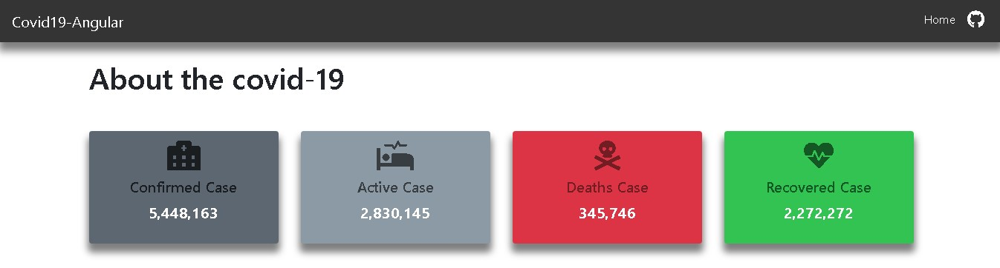
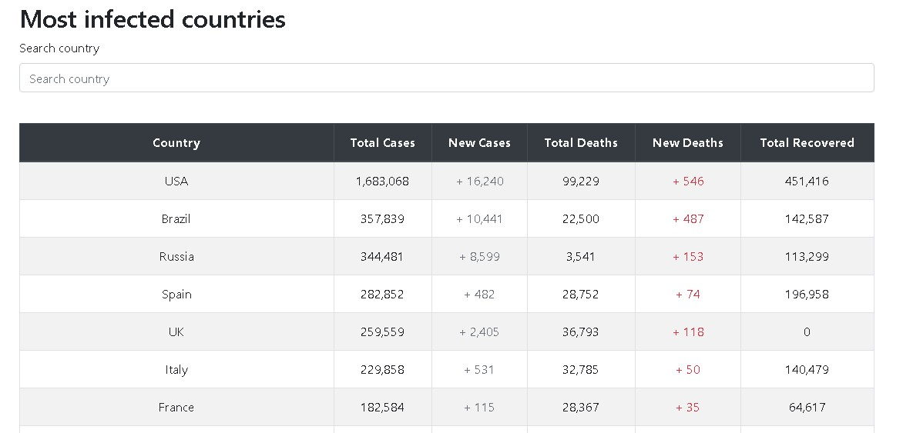

# AngularCovid19

This project is developed in order to practice Angular and TypeScript. 

## API REST

The displayed data is fetched from the REST API [ABOUT-CORONA.NET][corona]. The general information of the countries as flag are brought from the REST API [rest countries][country].

## Plugins

The graphics are made with [ng2-charts][charts], as a design framework [bootstrap][bootstrap] was used, for the icons  [font awesome][font-awesome] was used.

## Angular

This project was generated with [Angular CLI](https://github.com/angular/angular-cli) version 9.0.2.#

### Development server

Run `ng serve` for a dev server. Navigate to `http://localhost:4200/`. The app will automatically reload if you change any of the source files.

### Code scaffolding

Run `ng generate component component-name` to generate a new component. You can also use `ng generate directive|pipe|service|class|guard|interface|enum|module`.

### Build

Run `ng build` to build the project. The build artifacts will be stored in the `dist/` directory. Use the `--prod` flag for a production build.

### Running unit tests

Run `ng test` to execute the unit tests via [Karma](https://karma-runner.github.io).

### Running end-to-end tests

Run `ng e2e` to execute the end-to-end tests via [Protractor](http://www.protractortest.org/).

### Further help

To get more help on the Angular CLI use `ng help` or go check out the [Angular CLI README](https://github.com/angular/angular-cli/blob/master/README.md).

[corona]: https://about-corona.net/dashboard
[country]: http://restcountries.eu/
[charts]: https://www.npmjs.com/package/ng2-charts
[font-awesome]: https://fontawesome.com/icons?d=gallery
[bootstrap]: https://getbootstrap.com/